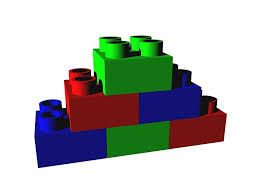
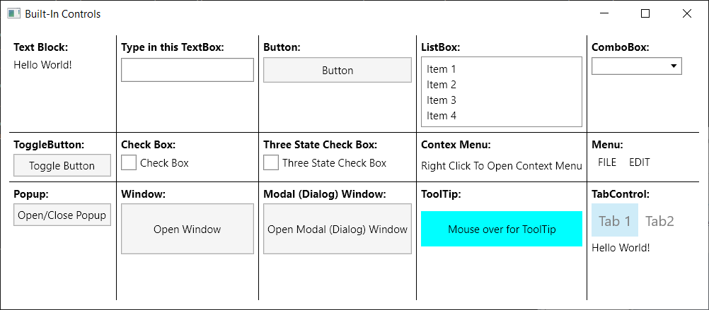

# Avalonia Building Blocks Explained with Samples

## Introduction to Avalonia Building Blocks



The best way to introduce a development framework is to show its off the shelf capabilities first in the most straightforward manner and then, based on that foundation explain the new concepts that come together with the framework. 

The Avalonia building blocks \(and the corresponding samples\) will provide the engineers with the breadth of knowledge of how to operate with Avalonia, while the explanation of the concepts will cover the knowledge depth.

The content of this guide is also covered in Multiplatform UI Coding with [AvaloniaUI in Easy Samples. Part 1 - AvaloniaUI Building Blocks](https://www.codeproject.com/Articles/5308645/Multiplatform-UI-Coding-with-AvaloniaUI-in-Easy-Sa) article and all the code samples are located under [NP.CodeForAvaloniaInEasySampleArticle](https://app.gitbook.com/@avalonia-ui/s/avalonia-docs-2/#creating-and-running-a-simple-avalonia-application-under-visual-studio) repository.

The following topics are covered in this article:

* The most useful Built-In Controls
* The primitives \(controls that serve as the primitive building blocks for the composition\)
* Panels
* Brushes
* Transform

## How to Read this Guide

This guide intends to be a hands on Avalonia tutorial highlighting Avalonia basic capabilities. It is full of coding examples that I recommend to build and run on your computer. It will be even better if you try to create and run examples similar to those of this guide yourself.

## Information about the Samples

All the code samples are located under [NP.CodeForAvaloniaInEasySampleArticle](https://github.com/npolyak/NP.CodeForAvaloniaInEasySampleArticle) repository.

All of the samples in this guide were created using Visual Studio 2019, .NET 5.0 and correspondingly C\# 9.0 though they can be easily downgraded to previous versions of .NET and C\#.

All the samples should be running on every one of the supported desktop platforms: Window, Linux and MacOS.

## Avalonia Built-In Controls

### Introduction to Avalonia Controls

In this section, I am going to describe some of the Built-in Avalonia controls which are most helpful for building an application. Note that for the sake of brevity,  not every built-in control will be described, only those that are most commonly used.

If you want to learn about the rest of the built in controls, you can:

* Download or clone the Avalinia source code from [Avalonia Source Code on Github](https://github.com/AvaloniaUI/Avalonia).
* Use Visual Studio to open _Avalonia.sln_ solution from the top level folder.
* Navigate within the solution explorer to `ControlCatalog.Desktop` project under _Samples_ Visual Studio folder.
* Make `ControlCatalog.Desktop` your startup project, then build and run it.

 The Windows application containing most \(if not all\) of the built-in controls will popup and you'll be able to see the capabilities of various control. By tracking them in XAML code under _Samples/Pages/_ Visual Studio folder, you will also be able to see how to create and change properties of those controls.

 New control creation and customization will be discussed in future sections as well as the most useful controls `ContentPresenter` and `ItemsPresenter` that can give a visual representation to a non-visual object or a collection of non-visual objects correspondingly.

The purpose of this section is to give an overview of the Built-In Avalonia controls, not a detailed description of their capabilities.

 Note that `Control` class in Avalonia is more primitive than the same named class in WPF - Avalonia `Control` does not have a template \(explanations on was Templates are and how to use them will be given in future sections\). The controls that have templates inherit from `TemplatedControl` class which implements `ITemplatedControl` interface. Because of that Avalonia `Image`, `Shape` and`Panel` classes are derived from the `Control`, not from `Visual` class \(as they are in WPF\).

### Built-In Controls Project

In this subsection, we'll describe some of the most useful controls in WPF sense, i.e., templated controls, not more primitive images, shapes and panels.

The code for these subsection is located under _NP.Demos.BuiltInControls.sln_ solution of [NP.CodeForAvaloniaInEasySampleArticle](https://github.com/npolyak/NP.CodeForAvaloniaInEasySampleArticle) github repository.

Here is what you are going to see if you build and run the solution:



 All the code specific to these controls is located within _MainWindow.xaml_ files. Let us go over each one of the controls and describe the XAML code related to them.

#### **TextBlock**

`TextBlock` is the only control from among the controls describes in the section, that cannot be retemplated - it is derived from `Control` \(not from `TemplatedControl` class\). So it is more of a primitive, rather than a composite control in WPF sense, but placed here, because it is one of the most important building blocks and \(from my viewpoint\) should be described first.

`TextBlock` represents simple text. Its most important property is `Text` of C\# `string` type. `Text` contains the text you want to display as the `TextBlock`.

`TextBlock` has a lot of properties that allow text customization, including:

* `Foreground` - the color of the text
* `FontSize` - self descriptive
* `FontFamily` - specifies the name of the font
* `FontWeight` - usually switches between Normal and Bold - for bold text
* `TextWrapping` - specifies if the text should be wrapped to multiple lines
* `TextTrimming` - specifies if ellipses \('...'\) characters should be shown if part of the text is invisible - the text stretches beyond the size of the control

Many of the properties listed above are also applicable to other controls that might have text, e.g., buttons, menus, ListBoxes and so on.

The simple XAML code to create a text block is e.g.:

```markup
<TextBlock Text="Hello World!">
```

#### **TextBox**

Here is an image for the `TextBox` sample:

If you type anything within the `TextBox`, its property `Text` will get updated with the typed text.

I used binding to duplicate the text typed within the `TextBox` by the `TextBlock` placed underneath. Here is the XAML code:

```markup
<Grid Grid.Row="1">
    <Grid.RowDefinitions>
      <RowDefinition Height="Auto"/>
      <RowDefinition Height="Auto"/>
    </Grid.RowDefinitions>
    <TextBox x:Name="TheTextBox"
             Width="150"
             Height="27"
             HorizontalAlignment="Left"
             Grid.Row="0"/>
    <TextBlock Text="{Binding Path=Text, ElementName=TheTextBox}"
               Grid.Row="1"
               Height="17"/>
  </Grid>
</Grid>
```

We defined the `Grid` panel with two rows - text box is in the top row \(`Grid.Row="0"`\) and `TextBlock` is in the second row \(`Grid.Row="1"`\).

We bind the `Text` property of the `TextBlock` to the `Text` property of the `TextBox` \(named "`TheTextBox`" via its `x:Name` attribute\) by using `ElementName` binding: `Text="{Binding Path=Text, ElementName=TheTextBox}"`. This produces the effect of the `TextBlock`below repeating the text entered into the `TextBox`.

#### **Button**

Next control we'll describe is `Button`:


Here is the code for our button:

```markup
<Button Content="Button"
        Padding="10,5"
        Grid.Row="1"/>
```

`Padding="10,5"` above means that the button extends from its content 10 generic pixels left and right and 5 top and bottom. `Grid.Row="1"` means that the button is placed in the second row of the `Grid` \(the first row is occupied by the header\).

Buttons define `Click` routed event - which is fired when the button is clicked. There are three ways to call C\# code on a Button click:

* Using code behind - as was shown in the `NP.Demos.SimpleAvaloniaProject` sample \(the **worst** method to use\).
* Using its `Command` property which can be bound to a View Model property. The View Model property in turn can define the lambda expression to call, when the button is clicked and also the property to control whether the button is enabled or not. This will be describe in detail in future articles.
* Using a behavior listening to `Click` routed event and calling a C\# method when the event is fired. \(this will also be described later\) - this is the best method.

#### **ListBox**


`ListBox` displays a collection of items with capability of selecting one item at a time. If the number of items exceeds the size of the `ListBox`, it will display the scroll bars.

The best way to use the list box is by binding its `Items` property to a collection. How to do it will be shown below. In our case, we simply created `ListBoxItem`s within the XAML code to populate it:

```markup
<ListBox x:Name="TheListBox">
  <ListBoxItem Content="Item 1"/>
  <ListBoxItem Content="Item 2"/>
  <ListBoxItem Content="Item 3"/>
  <ListBoxItem Content="Item 4"/>
</ListBox>
```

The most important properties of the `ListBox` are `Items` mentioned above and selection related properties: `SelectedIndex` and `SelectedItem`. The `SelectedIndex` of this `ListBox` is bound to the `SelectedIndex` of the `ComboBox` described in the next subsection, so when you change the selected item on each of them, the other will react in the same fashion.

#### **ComboBox**


`ComboBox` is also called `DropDownBox` in various other frameworks. Just like `ListBox` it also stores a collection of items, but only selected item is displayed all the time - the other items are only displayed in a popup \(or rather drop-down\) when the mouse pointer clicks the arrow on its right hand side. The image above displays the `ComboBox` without a selected item but with the open `dropdown`. Here is the code that I used to create and populate the `ComboBox`:XMLCopy Code

```markup
<ComboBox VerticalAlignment="Top"
          Grid.Row="1"
          SelectedIndex="{Binding Path=SelectedIndex, ElementName=TheListBox}">
  <ComboBoxItem Content="Item 1"/>
  <ComboBoxItem Content="Item 2"/>
  <ComboBoxItem Content="Item 3"/>
  <ComboBoxItem Content="Item 4"/>
</ComboBox>
```

Same as in case of `ListBox`, `ComboBox`es' main properties are `Items` \(to be bound to a collection\), `SelectedIndex` and `SelectedItem`. The example shows how to bind the `SelectedIndex` of the `ComboBox` to that of the `ListBox` to the left of it: `SelectedIndex="{Binding Path=SelectedIndex, ElementName=TheListBox, Mode=TwoWay}"`, so that when one changes Selection, the other will also change.

#### **ToggleButton**


`ToggleButton` is a control that has two states - Checked and Unchecked controlled by its boolean property `IsChecked`. Every time the button is clicked, its `IsChecked` property toggles its value from `false` to `true` and vice versa. The button's background changes depending on whether it is checked or unchecked:

```markup
<ToggleButton x:Name="TheToggleButton" 
              Content="Toggle Button"/>
```

Again, in order to demonstrate the power of the binding, I bound the `ToggleButton`'s `IsChecked` property to that of the `CheckBox` next to it so that they change in sync.

#### **CheckBox**


`CheckBox` is very similar to the toggle button, but looks different \(as you can see\). Here is the XAML code for `CheckBox`:

```markup
<CheckBox Content="Check Box"
          VerticalAlignment="Top"
          Grid.Row="1"
          IsChecked="{Binding Path=IsChecked, ElementName=TheToggleButton}"/>
```

You can see the binding that connects its `IsChecked` property to that of the `ToggleButton` on its left.

`CheckBox` also has a switch property `IsThreeState` and when it is set to `true`, the `CheckBox` can switch between three states - false, true and undefined - which corresponds to its `IsChecked` property set to `null`:


Here is the code for three state `CheckBox`:

```markup
<CheckBox Content="Three State Check Box"
          IsThreeState="True"/>
```

#### **ContextMenu**


`ContextMenu` opens up when right mouse button is clicked on some area or control. Here is the code:

```markup
<Grid Grid.Row="1"
    Background="Transparent">
  <Grid.ContextMenu>
    <ContextMenu Grid.Row="1">
      <MenuItem Header="Item1">
        <MenuItem Header="SubItem1"/>
        <MenuItem Header="SubItem2"/>
      </MenuItem>
      <MenuItem Header="Item2"/>
      <MenuItem Header="Item3"/>
      <MenuItem Header="Item4"/>
    </ContextMenu>
  </Grid.ContextMenu>
  <TextBlock Text="Right Click To Open Context Menu"
             VerticalAlignment="Center"/>
</Grid>
```

#### **Menu**


Menus are usually placed at the top of the window, but can also appear in other places. Here is the XAML code for the `Menu` sample:

```markup
<Menu Grid.Row="1">
    <MenuItem Header="FILE">
      <MenuItem Header="New"/>
      <MenuItem Header="Open"/>
      <MenuItem Header="Save"/>
    </MenuItem>
    <MenuItem Header="EDIT">
      <MenuItem Header="Copy"/>
      <MenuItem Header="Paste"/>
    </MenuItem>
</Menu>
```

#### **Popup**

Popup is a control that opens a light weight window next to the so called popup's `PlacementTarget`:


Whether the popup is open or not is controlled \(and reflected\) by its `IsOpen` property which in our case is tied to the `IsChecked` property of the `ToggleButton` that controls \(and reflects\) the popup's state:

```markup
<Grid Grid.Row="1">
    <Grid.RowDefinitions>
      <RowDefinition Height="Auto"/>
      <RowDefinition Height="*"/>
    </Grid.RowDefinitions>
    <ToggleButton x:Name="OpenClosePopupButton"
                  Content="Open/Close Popup"/>

    <Popup x:Name="ThePopup"
           Grid.Row="1"
           IsOpen="{Binding Path=IsChecked, ElementName=OpenClosePopupButton, Mode=TwoWay}"
           StaysOpen="False"
           PlacementMode="Bottom"
           PlacementTarget="{Binding ElementName=OpenClosePopupButton}">
      <Grid x:Name="PopupsContent"
            Background="Red"
            Width="150"
            Height="70">
        <TextBlock Text="Popup's Content"
                   HorizontalAlignment="Center"
                   VerticalAlignment="Center"/>
      </Grid>
    </Popup>
</Grid>
```

We use a two way binding to bind the Popup's `IsOpen` property to the `ToggleButton`'s `IsChecked` property so that changing each one of them would affect the other.

`StaysOpen` property is set to `false` - meaning that clicking out of the popup area will close the popup.

`PlacementTarget` property specifies an element with respect to which the `Popup` is going to be positioned.

`PlacementMode="Bottom"` means that the `Popup` will be positioned at the bottom of the placement target.

#### **Window**


When you click the button of the "`Window`" sample, a small window will open.

Here is the XAML code for the window sample:

```markup
<Button x:Name="OpenWindowButton"
        Content="Open Window"/>
```

The C\# code that opens the window is hooked via code-behind - not because it is a good way to do it \(actually it is the **worst** as was mentioned above\) - but because it is the simplest way and the easiest to understand. Here is the relevant C\# code from _MainWindow.axaml.cs_ file:

```csharp
public MainWindow()
{
    ...

    var openWindowButton = this.FindControl<Button>("OpenWindowButton");

    openWindowButton.Click += OpenWindowButton_Click;
    ...
}
private void OpenWindowButton_Click(object? sender, RoutedEventArgs e)
{
    // Create the window object
    Window sampleWindow = 
        new Window 
        { 
            Title = "Sample Window",
            Width = 200,
            Height = 200
        };

    // open the window
    sampleWindow.Show();
}
```

In `MainWindow`'s constructor \(after the call to `InitializeComponent()`\) we find the button by its name and attach a handler to its `Click` event. Within that handler, we create the new `Window` object and call `Show()` method on it to display \(open\) the window.

#### **Modal Window**

Modal Window is also called a Dialog - it is a window that prevents any actions on its ancestor windows until it is closed.


Pressing "**Open Modal \(Dialog\) Window**" button will open a dialog window which completely blocks the main window until it is closed. Here is the XAML code:

```markup
<Button x:Name="OpenModalWindowButton"
        Content="Open Modal (Dialog) Window"/>
```

Again, we connect the C\# code using the no-good code-behind paradigm:

```csharp
public MainWindow()
{
    ...

    var openModalWindowButton = this.FindControl<Button>("OpenModalWindowButton");

    openModalWindowButton.Click += OpenModalWindowButton_Click;
}
...
private void OpenModalWindowButton_Click(object? sender, RoutedEventArgs e)
{
    // Create the window object
    Window sampleWindow = 
        new Window 
        { 
            Title = "Sample Modal (Dialog) Window",
            Width = 200,
            Height = 200
        };

    // open the modal (dialog) window
    sampleWindow.ShowDialog(this);
}
```

The only difference between this and previous samples, is that here we call `sampleWindow.ShowDialog(...)` method instead of `sampleWindow.Show()`, passing to it the current window as the parent of the dialog.

#### **ToolTip**

`ToolTip` is the temporary popup that opens next to the mouse pointer over an element that defines that `ToolTip`:


Here is how we define the `ToolTip` in XAML:

```markup
<Grid Height="40"
      Background="Aqua"
      ToolTip.Tip="This is the ToolTip">
```

Most of the time `ToolTip` is just a text \(as in our case\) but sometimes it can become more involved controls.

#### **TabControl**

`TabControl` allows to display different tabs - each tab containing different content:


Switching between the tabs in our sample will change the displayed text from "`Hello World!`" to "`Hi World!`".

Here is the very simple XAML code to achieve that:

```markup
<TabControl Grid.Row="1">
    <TabItem Header="Tab 1">
        <TextBlock Text="Hello World!"/>
    </TabItem>
    <TabItem Header="Tab2">
        <TextBlock Text="Hi World!"/>
    </TabItem>
</TabControl>
```

## Avalonia Primitives

### Introduction to Primitives

Primitives are the non-composable Avalonia UI controls \(which are not panels either\). They that are derived from `Control` and not from `TemplatedControl`. In WPF, they would not even be called controls but visuals. One of the primitives was already described above - it is `TextBlock` element.

Other than `TextBlock` presented above, the most important primitives are `Border`, `Viewbox`, `Image` and `Shape`. Shapes are controls derived from `Shape` - the most used among them are `Path` \(for any shape\), `Line`, `Rectangle` and `Ellipse`.

### Primitives Samples Code Location

Code for this section is located under `NP.Demos.Primitives` solution within [NP.CodeForAvaloniaInEasySampleArticle](https://github.com/npolyak/NP.CodeForAvaloniaInEasySampleArticle) github repository:


Instead having all primitives on the same page \(as in the previous section\), we'll be using one tab of the `TabControl` for every primitive type. This way, we can be a bit more detailed regarding these very important Avalonia basic building blocks.

### Primitives Samples

#### **Border**

The tab container the `Border` sample is displayed on the picture above. Here is the XAML code that was used to create such border with the text inside:

```markup
<Border Margin="20"
      BorderThickness="10"
      BorderBrush="Red"
      Background="Blue"
      CornerRadius="0, 10, 40, 120">
    <TextBlock Foreground="White"
               FontSize="20"
               Text="Border Example!"
               HorizontalAlignment="Center"
               VerticalAlignment="Center"/>
</Border>
```

The `TextBlock` "Border Example" is placed inside the `Border` - it sets the `Border.Child` property to be the `TextBlock`.

* `BorderThickness="10"` - specifies that the size of the real border of the `Border` element.
* `BorderBrush` - is the color of the border.
* `Background` specifies the color inside the border.
* `CornerRadius` - specifies how round the corners of the border are. All 4 corners of the border have different radius on purpose in order to show the full capabilities of the `CornerRadius` property.

**Important Note**: We recommend not to set the border `Child` property, but instead, place the border inside a `Grid` panel and place the element you want to be inside the border within the same panel as the sibling of the border. This is because if the borders get a shadow \(and they are often required to\) their descendant elements get slightly dithered. However, the elements that are NOT direct descendants of the border will not be affected.

#### **Viewbox**

`Viewbox` is a control that allows to visually shrink or expand everything within it. Just like the border, it has a `Child` property to place the content in. You can place there any complex visual element or a panel containing a number of visual elements and everything will be visually resized in accordance with `Viewbox` parameters.

`Viewbox` will receive the size from its descendants. The `Viewbox`'s child will always shrink to minimal size, allowed by its own descendants even if its `HorizontalAlignment` and `VerticalAlignment` properties are set to `Stretch`. If `Viewbox`'s child does not specify the size and cannot derive the size from its own children, e.g., a `Grid` without `Height` and `Width` and without any children that could define its size, it will shrink to 0 size.

Our example under "**Viewbox**" tab shows how a labeled `TextBox` changes when `Stretch` property of the `Viewbox` is set to different values. You can play with it yourself by setting the `Stretch` property on the left to different values and then trying to resize the window.

Here is the code for our `Viewbox` sample:

```markup
<Viewbox x:Name="TheViewBox" 
         Stretch="{Binding Path=SelectedItem, ElementName=StretchChooser, Mode=TwoWay}"
         Grid.Column="1">
    <Grid  Width="640"
           Height="238"
           Background="LightBlue">
      <TextBlock FontSize="20"
                 Text="Enter Text: "
                 HorizontalAlignment="Left"
                 VerticalAlignment="Center"
                 Margin="20"/>
      <TextBox Grid.Column="1"
               Width="300"
               FontSize="20"
               Margin="20"
               Text="Hello World!!!"
               HorizontalAlignment="Right"
               VerticalAlignment="Center"/>
    </Grid>
</Viewbox>
```

And here is how it looks when we shrink the control and `Stretch="None"`.


If the stretch is set to `None` - the child of the view box will not resize at all - so when you make the window smaller - you will cut into the content of the `viewbox` as shown above.

Here is the picture for `Stretch="Fill"`:


The `width` and `height` of the `Viewbox`'s child resize in proportion to the change of `width` and `size` - in our case, we make the `width` smaller \(thinner\) and the height - larger. Under "`Fill`", no original aspect ration \(`width`/`height`\) is preserved, but whatever inside the `Viewbox`will size to the height and width of the `Viewbox`. 

The rest of the possible `Stretch` values do preserve the aspect ration of the original controls. Here is what happens when we shrink `width`, but increase the `height` under `Stretch="Uniform"`:


The control shrinks \(or expands\) while preserving the original aspect ration so that it all can fit into the space.

Finally, when `Stretch="UniformToFill"` - the child control still preserves the aspect ration in such a way that one of its dimensions completely fills the space that is given to it and the other dimension is possibly cut - as on the image below - Y dimension fits into the `height`, while X dimension is cut:


Note that some other primitives - `Images` and `Shapes` also have `Stretch` property that behaves in exactly the same ways.

#### **Image**

You should play with the Image sample under the **Image** tab:


Try choosing different `Stretch` modes and see how the `Image` resizes differently under each one of them.

Here is the relevant XAML code for the `Image` sample:

```markup
<Grid ColumnDefinitions="Auto, *">
    <StackPanel VerticalAlignment="Top"
        HorizontalAlignment="Center">
      <TextBlock Text="Choose Stretch Type"/>
      <ComboBox x:Name="ImageStretchChooser"
                Items="{Binding Source={x:Type Stretch}, 
                Converter={x:Static local:EnumTypeToCollectionConverter.Instance}}"
                Width="100"
                Height="30"
                Margin="10"/>
    </StackPanel>
    <Grid Grid.Column="1">
        <Image x:Name="TheImage"
               Stretch="{Binding #ImageStretchChooser.SelectedItem, Mode=TwoWay}"
               Source="/Images/LinuxIcon.jpg"/>
    </Grid>
</Grid>
```

The most important property defined on `Image` is `Source`. In XAML, it points to the actual Image png or jpg or other file: `Source="/Images/LinuxIcon.jpg"`. Note that the image file _LinuxIcon.jpg_ is defined in the same project and its Build Action is `AvaloniaResource`:


Note, also that the `Source` property of the `Image` class is of type `IImage`, so if you wanted to assign it in C\# code, you'd have to write, e.g.:C\#Copy Code

```csharp
Image image = this.FindControl<Image>("TheImage");
var assets = AvaloniaLocator.Current.GetService<IAssetLoader>();
image.Source = 
    new Bitmap(assets.Open(new Uri("avares://NP.Demos.Primitives/Images/LinuxIcon.jpg")));
```

XAML type conversions make the `Source` assignment considerably simpler, but sometimes, you cannot avoid using C\#.

Note that `Bitmap` is one of the implementations of `IImage` and this is why the code above works.

The cryptic prefix "avares" in the URL "_avares://NP.Demos.Primitives/Images/LinuxIcon.jpg_", stands for "Avalonia Resource" and not for the capital of Hyksos in Egypt.

#### **Shapes**

Shapes are - various geometric shapes. Here is how **Shapes** tab looks:


You can play with the `Stretch`, `StrokeThickness` and `Fill` properties. You can see that `Rectangle` and `Ellipse` are not affected by `Stretch` - which makes sense since they are determined by their `width` and `height`.

Line and `Path` are affected by `Stretch` in pretty much the same way as the `Image` and `Viewbox`.

`StrokeThickness` determines the thickness of the border. `Stroke` property \(of type `IBrush`\) determines the color of the border.

`Fill` specifies the color of the inside - in our case, when `HasFill checkbox` is on, the `Fill` is `red`, while, when it is not on, the `Fill` is `null` \(essentially transparent, but also hit test invisible\).

Here is the XAML code for the line:

```markup
<Line StartPoint="0,0"
      EndPoint="50, 50"
      Grid.Row="1"
      Stretch="{Binding Path=#ShapeStretchChooser.SelectedItem}"
      Stroke="Black"
      Margin="20"
      StrokeThickness="{Binding Path=#ThicknessSlider.Value}"
      Fill="{Binding Path=#HasFillCheckBox.IsChecked, 
                     Converter={StaticResource FillConverter}}"/>
```

The major line defining properties are `StartPoint` and `EndPoint` which determine the origin and end of the line.

The shape of both `Rectangle` and `Ellipse` are determined by their `width` and `height` - they should either be specified explicitly or by how much space their container has for them.

`Path` is the most generic shape. It is determined by its `Data` property of type `Geometry`. Creating Geometries for different shapes is a science of its own, and is beyond this tutorial. For ready made geometries, you can go to [Material Design Icons](https://materialdesignicons.com/), choose the icon you want and check its XAML representation.

Here is the code for our `Path` sample:

```markup
<Path Data="M11.92,19.92L4,12L11.92,4.08L13.33,5.5L7.83,
            11H22V13H7.83L13.34,18.5L11.92,19.92M4,12V2H2V22H4V12Z"
      Stretch="{Binding #ShapeStretchChooser.SelectedItem}"
      Stroke="Black"
      Grid.Row="1"
      Margin="20"
      StrokeThickness="{Binding #ThicknessSlider.Value}"
      Fill="{Binding Path=#HasFillCheckBox.IsChecked, Converter={StaticResource FillConverter}}"/>
```

The `Data` is set to some cryptic `Geometry string` copied from [Material Design Icons](https://materialdesignicons.com/).

## Avalonia Panels

### Introduction to Panels

Panels are Avalonia primitive controls that serve to arrange other controls placed inside them. Aside from their `Background color`, panels themselves do not have any visual representation, but they are indispensable for ordering and arranging other controls.

Code for the Panels is located under _NP.Demos.Panels.sln_ solution of [NP.CodeForAvaloniaInEasySampleArticle](https://github.com/npolyak/NP.CodeForAvaloniaInEasySampleArticle) github repository.

### Panels Samples

#### **StackPanel**

When you open the application, you are going to land on the `StackPanel` tab:


There are three square buttons 100x100 generic pixels arranged in a stack - on the left it is a vertical stack, on the right - horizontal.

Here is the XAML code for vertical stack:

```markup
<StackPanel Orientation="Vertical"
            Grid.Row="1"
            VerticalAlignment="Top"
            HorizontalAlignment="Left">
  <Button Content="1"
          Width="100"
          Height="100"/>
  <Button Content="2"
          Width="100"
          Height="100"/>
  <Button Content="3"
          Width="100"
          Height="100"/>
</StackPanel>
```

`Orientation="Vertical"` is what defines the orientation. Vertical orientation is a default - so the first attribute could have been skipped.

In order to achieve the horizontal orientation displayed on the right, all you need to do is to replace `Orientation` to be `Orentation="Horizontal"`. This is how the stacking on the right is achieved.

If you resize the window, you can see that when the window gets too small, the ends of the `StackPanels` are being cut. `WrapPanel` addresses this problem.

#### **WrapPanel**

Go to `WrapPanel`tab in order to play with the `WrapPanel`. If you make it smaller, you'll see that the last item\(s\) instead of cutting - wrap, the vertical panel wraps last item\(s\) to the right, and the horizontal - to the bottom:


#### **Grid**

Net tab displays `Grid` which is the most complex and useful panel:


Our `Grid` has 4 rows and 4 columns - here is how they are defined:

```markup
<Grid RowDefinitions="80, Auto, *, 2*"
      ColumnDefinitions="80, Auto, *, 2*"
      ...>
```

The definitions above are allowed due to Avalonia shortcut for typing the row and column definitions. The usual WPF way is also allowed, here how such definition would look:

```markup
<Grid>
  <Grid.RowDefinitions>
    <RowDefinition Height="80"/>
    <RowDefinition Height="Auto"/>
    <RowDefinition Height="*"/>
    <RowDefinition Height="2*"/>
  </Grid.RowDefinitions>
  <Grid.ColumnDefinitions>
    <ColumnDefinition Width="80"/>
    <ColumnDefinition Width="Auto"/>
    <ColumnDefinition Width="*"/>
    <ColumnDefinition Width="2*"/>
  </Grid.ColumnDefinitions>
</Grid>
```

You can see that Avalonia shortcuts are saving a lot of space.

Here are the interpretations for row height and column width. The first row's \(`Height="80"`\) height is 80 generic pixels. The second row \(`Height="Auto"`\) is sized to its content - i.e., its size is determined by what it contains. The third and fourth rows are star rows \(`Height="*"` and `Height=2*`\). Together, all the star rows and columns are taking all the rest of the space that the `Grid` is allowed to take, and between them the space is distributed based on their star coefficients. Since the last row has coefficient 2, the space allocated to it will always be twice the space allocated to the row before last.

The columns' widths are calculated in exactly the same fashion.

Open the `Grid` tab of the application and play with it by resizing the window horizontally and vertically.

#### **DockPanel**

The `DockPanel` allows arranging its children next to its sides, while the last child \(undocked\) will take the rest of the space.

The dock value is determined by `DockPanel.Dock` attached property which can assume values `Left`, `Top`, `Right` and `Bottom`.

In our sample, we have 8 buttons arranged clockwise - `Left`, `Top`, `Right`, `Bottom` and again `Left`, `Top`, `Right`, `Bottom` and then one last button that takes the rest of the space:


Here is the code for our `DockPanel` sample:

```markup
<DockPanel Margin="20">
  <Button Content="1"
          DockPanel.Dock="Left"
          Width="30"/>
  <Button DockPanel.Dock="Top"
          Content="2"
          Height="30"/>
  <Button DockPanel.Dock="Right"
          Content="3"
          Width="30"/>
  <Button DockPanel.Dock="Bottom"
          Content="4"
          Height="30"/>
  <Button DockPanel.Dock="Left"
          Content="5"
          Width="30"/>
  <Button DockPanel.Dock="Top"
          Content="6"
          Height="30"/>
  <Button DockPanel.Dock="Right"
          Content="7"
          Width="30"/>
  <Button DockPanel.Dock="Bottom"
          Content="8"
          Height="30"/>
  <Button Content="The Rest"/>
</DockPanel>
```

Note that the `widths` of the vertically docked buttons and the `heights` of the horizontally docked buttons are `30`.

#### **Canvas**

`Canvas` is the panel which allows placing controls in it by coordinates from the Top Left corner determined by attached properties `Canvas.Left` and `Canvas.Top`:


On the canvas above, the button is placed 300 generic pixels to the right and 200 to the bottom from the top left corner. Here is the XAML code:

```markup
<Canvas>
  <Button Content="1"
          Width="100"
          Height="100"
          Canvas.Left="300"
          Canvas.Top="200"/>
</Canvas>
```

#### **RelativePanel**

`RelativePanel` does not exist in WPF. It can be, however, very useful, especially when coding for tablets and phones. It allows specifying location of elements both with respect to the panel and with respect to other named elements within the same panel.

Here is how our `RelativePanel` sample looks:


`RelativePanel` provides a lot of so called Attached Properties that allow to choose a position it child with respect to the panel itself or with respect to the other named children of the same panel. Here is the XAML code for the example above:

```markup
<RelativePanel Margin="20"
               Background="LightBlue">
  <Button x:Name="Button1"
          Height="50"
          Content="Button1 - TopLeftCorner by default"/>
  <Button x:Name="Button2"
          Height="50"
          RelativePanel.AlignTopWithPanel="True"
          RelativePanel.AlignHorizontalCenterWithPanel="True"
          Content="Button2 - Mid Top"/>

  <Button x:Name="Button3"
          Height="50"
          RelativePanel.AlignBottomWithPanel="True"
          RelativePanel.AlignRightWithPanel="True"
          Content="Button3 - Bottom Right"/>

  <Button x:Name="Button4"
          Height="50"
          RelativePanel.AlignHorizontalCenterWithPanel="True"
          RelativePanel.AlignVerticalCenterWithPanel="True"
          Content="Button4 - Center"/>

  <Button x:Name="Button5"
          Height="50"
          RelativePanel.RightOf="Button4"
          RelativePanel.Below="Button4"
          Content="Button5 - Bottom right from Button4"/>
</RelativePanel>
```

You can see from this example that one can place the control aligned to any `RelativePanel` side by using, e.g., `RelativePanel.AlignBottomWithPanel` and `RelativePanel.AlignRightWithPanel` property. One can also use properties `RelativePanel.RightOf` and `RelativePanel.Below` to place a control to the bottom right of another control.

## Avalonia Brushes

### Introduction to Brushes

Avalonia Brushes are used to specify the colors and color changes for Avalonia Controls.

Avalonia has the following brushes:

* `SolicColorBrush` class for representing single color
* `LinearGradientBrush` class for representing color changing spacially in one direction
* `RadialGradientBrush` class for representing color changing based on eliptic curves around a certain point.
* `ConicGradientBrush` class for representing color changing conically around a point.  

First 3 brushes also exist in WPF, while the third \(Conic\) is unique to Avalonia.

The `Brushes` sample is located under _NP.Demos.Brushes.sln_ solution of [NP.CodeForAvaloniaInEasySampleArticle](https://github.com/npolyak/NP.CodeForAvaloniaInEasySampleArticle) github repository:


### Brushes

#### **SolidColorBrush**

`SolidColorBrush` is covered by the first two samples: the first one specifies the color by name \(`Background="Red"`\) and the second - by ARGB values \(Background="\#FF43A047"\).

#### **LinearGradientBrush**

Here is the XAML for `LinearGradientBrush` sample:

```markup
<LinearGradientBrush StartPoint="0%,0%"
                      EndPoint="100%,100%" >
  <LinearGradientBrush.GradientStops>
    <GradientStop Offset="0" Color="Red"/>
    <GradientStop Offset="0.25" Color="Blue"/>
    <GradientStop Offset="0.5" Color="Brown"/>
    <GradientStop Offset="0.75" Color="Green"/>
    <GradientStop Offset="1" Color="Purple"/>
  </LinearGradientBrush.GradientStops>
</LinearGradientBrush>
```

Coordinates of Start and End Points are counted from the top left corner of the control \(`Button` in our case\). In our case - `StartPoint` is the top left corner and end point is the bottom right corner \(100%, 100% point\).

The gradient stops specify the proportional offset along the line segment from the start point to the end point and the colors that should be at the corresponding offsets.

#### **RadialGradientBrush**

Here is the XAML for `RadialGradientBrush`:

```markup
<RadialGradientBrush GradientOrigin="25%,25%"
                      Center="50%, 50%"
                      Radius="0.5" >
  <RadialGradientBrush.GradientStops>
    <GradientStop Offset="0" Color="Red"/>
    <GradientStop Offset="0.25" Color="Blue"/>
    <GradientStop Offset="0.5" Color="Brown"/>
    <GradientStop Offset="0.75" Color="Green"/>
    <GradientStop Offset="1" Color="Purple"/>
  </RadialGradientBrush.GradientStops>
</RadialGradientBrush>
```

`RadialGradientBrush` has two important points - `GradientOrigin` and `Center`. The gradient circles are arranged on the line connecting those two points with the center of the circles converging to `GradientOrigin` at offset 0 and to `Center` at offset 1. The size of the circles is controlled by `Radius` \(a double between 0 and 1\).

The Avalonia `RadialGradientBrush` is less powerful than that of WPF since WPF allows entering two numbers for radius: `RadiusX` and `RadiusY` allowing ellipses on top of the circles.

#### **ConicGradientBrush**

Here is the XAML code for `ConicGradientBrush`:

```markup
<ConicGradientBrush Center="30%, 30%"
                    Angle="90">
  <ConicGradientBrush.GradientStops>
    <GradientStop Offset="0" Color="Red"/>
    <GradientStop Offset="0.25" Color="Blue"/>
    <GradientStop Offset="0.5" Color="Brown"/>
    <GradientStop Offset="0.75" Color="Green"/>
    <GradientStop Offset="1" Color="Purple"/>
  </ConicGradientBrush.GradientStops>
</ConicGradientBrush>
```

In case of `ConicRadialBrush`, the colors are arranged conicаlly around a certain point specified by the `Center` property. `Angle` property specifies the clockwise angle in degrees between the Vertical axis and the first color \(color at offset 0\) - in our case, it is 90 degrees so the red color starts horizontally.

## Avalonia UI Transforms

### Introduction to Avalonia Transforms

Transforms allow 2D linear affine transforms on any Avalonia UI controls.

Transforms code is located under _NP.Demos.Transforms.sln_ solution of [NP.CodeForAvaloniaInEasySampleArticle](https://github.com/npolyak/NP.CodeForAvaloniaInEasySampleArticle) github repository.

### **RenderTransform vs LayoutTransform**

In WPF, every element has the ability to run Render and Layout transforms on it. `RenderTransform` performs the transform after the layout is completed \(without affecting the layout around the control\). `LayoutTransform` performs the layout operations after the new \(transformed\) control's coordinates are calculated.

Since, `RenderTransform` is used much more often than `LayoutTransform`, Avalonia allows to perform `RenderTransform` on each Avalonia control \(same as WPF\), but `LayoutTransform` can only be performed on `LayoutTransformControl`. If you need to perform `LayoutTransform` on any control, you can always make it a child of `LayoutTransformControl` and do the `LayoutTransform` on that `LayoutTransformControl` instead as shown in our sample.

### Avalonia Transforms

#### RotateTransform

Here is what you get if you try to run the sample and change the Rotation angle of the `RotationTransform`:


You can see that Render Transformed button will show outside of the `Grid` panel that contains it, while Layout Transformed button will expand its `Grid` container \(container panels are shown in light blue\).

Here is the relevant code for the sample:

```markup
<Grid Margin="5"
      Grid.Column="2">
  <Grid.RowDefinitions>
    <RowDefinition Height="Auto"/>
    <RowDefinition Height="*"/>
  </Grid.RowDefinitions>
  <TextBlock Text="Render Rotate Transform Sample:"
              Classes="h1"/>

  <Grid Width="200"
        VerticalAlignment="Center"
        Grid.Row="1"
        Background="LightBlue">
    <Button Width="100"
            Height="25"
            RenderTransformOrigin="50%, 50%"
            HorizontalAlignment="Center"
            VerticalAlignment="Center">
      <Button.RenderTransform>
        <TransformGroup>
          <RotateTransform Angle="{Binding Path=Value, ElementName=AngleSlider}"/>
        </TransformGroup>
      </Button.RenderTransform>
    </Button>
  </Grid>
</Grid>

<Grid Margin="5"
      Grid.Column="4">
  <Grid.RowDefinitions>
    <RowDefinition Height="Auto"/>
    <RowDefinition Height="*"/>
  </Grid.RowDefinitions>
  <TextBlock Text="Layout Rotate Transform Sample:"
              Classes="h1"/>

  <Grid Width="200"
        VerticalAlignment="Center"
        Grid.Row="1"
        Background="LightBlue">
    <LayoutTransformControl HorizontalAlignment="Center"
                            VerticalAlignment="Center">
      <Button Width="100"
              Height="25"
              HorizontalAlignment="Center"
              VerticalAlignment="Center"/>
      <LayoutTransformControl.LayoutTransform>
        <TransformGroup>
          <RotateTransform Angle="{Binding Path=Value, ElementName=AngleSlider}"/>
        </TransformGroup>
      </LayoutTransformControl.LayoutTransform>
    </LayoutTransformControl>
  </Grid>
</Grid>
```

You can see, that in order to achieve the layout transformation, out button is placed inside the `LayoutTransformControl` and `RotateTransform` is applied to this `LayoutTransformControl` and not to the button itself.

Important property of the `RotateTransform` is angle in degrees which specifies the rotation angle.

#### **TranslateTransform**


Changing `TranslateTransform`'s properties `X` and `Y` will shift the control by `X` pixels to the right and `Y` pixels to the bottom:

```markup
<Button Width="100"
        Height="25"
        HorizontalAlignment="Center"
        VerticalAlignment="Center">
  <Button.RenderTransform>
    <TranslateTransform X="{Binding #XSlider.Value}"
                        Y="{Binding #YSlider.Value}"/>
  </Button.RenderTransform>
</Button>
```

#### **ScaleTransform**


Scale transform expands or shrinks the controls horizontally or vertically. Horizontal and Vertical scaling is controlled by `ScaleX` and `ScaleY` properties correspondingly:

```markup
<Button Width="100"
        Height="25"
        Grid.Column="2"
        HorizontalAlignment="Center"
        VerticalAlignment="Center">
  <Button.RenderTransform>
    <ScaleTransform ScaleX="{Binding #ScaleXSlider.Value}"
                    ScaleY="{Binding #ScaleYSlider.Value}"/>
  </Button.RenderTransform>
</Button>
```

#### **SkewTransform**


`SkewTransform` skews the image horizontally or vertically \(or both\) depending on its `AngleX` and `AngleY` properties:

```markup
<Button Width="100"
        Height="25"
        Grid.Column="2"
        HorizontalAlignment="Center"
        VerticalAlignment="Center">
  <Button.RenderTransform>
    <SkewTransform  AngleX="{Binding #SkewXSlider.Value}"
                    AngleY="{Binding #SkewYSlider.Value}"/>
  </Button.RenderTransform>
</Button>
```

#### **More on the Subject of Transforms**

Avalonia has `MatrixTransform` which is a generic linear affine transform. All the rest of the available Avalonia transforms \(rotate, translate, scale and skew transforms\) are just `private` cases of the `MatrixTransform`. It is rarely used, though, because it is not intuitive.

One can combine multiple transforms by placing them inside `TransformGroup` object.

