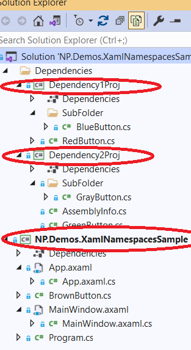

# Avalonia Concepts Explained by Easy Samples

## Introduction

This is a hands on guide to the Avalonia \(and WPF\) concepts providing C\# samples which highlight each concept. I recommend that you run all the samples and also try to create similar samples by yourself in order to completely master the Avalonia concepts.

## Avalonia XAML Basics in Samples

### Introduction to XAML 

XAML is XML used for building C\# \(mostly visual\) objects.

 C\# classes are displayed as XML tags, while class properties are usually displayed as XML attributes:

```markup
<my_namespace:MyClass Prop1="Hello World"
                      Prop2="123"/>
```

The XAML code in the example above creates an object of type `MyClass` from XML namespace `my_namespace` and sets its properties `Prop1` to string "Hello World" and `Prop2` to value `123`. Note that the properties will be resolved to their C\# type, e.g. if `Prop2`is of `int` type, it will be resolved to `123` integer value, while if it is of `string` type, it will be resolved to `"123"` string. If the property or type mentioned in XAML file do not exist, the compilation of the project that contains that XAML will fail and often the Visual Studio will detect an error even before the compilation and will underscore the missing type or property with a red broken line.

The namespace \(in our sample it is "my\_namespace"\) should usually be defined above or within the XML tag where it is used. It can point to a C\# namespace or a set of C\# namespaces \(as will be explained below with an appropriate example\).

XAML file can be associated with a C\# file called "code-behind" to define the same class using "partial class" declarations. The C\# code-behind usually contains definitions of methods that serve as event handlers for the events fired by elements defined in XAML file. This way of associating events fired by XAML elements and C\# event handlers is the easies and most straightforward and was already explained in [Creating and Running a Simple Avalonia Application under Visual Studio sample](https://app.gitbook.com/@avalonia-ui/s/avalonia-docs-2/#creating-and-running-a-simple-avalonia-application-under-visual-studio) section, but is also the worst, since it breaks the important MVVM pattern \(as will be shown later\) and should almost never be used.

In the rest of this chapter, we shall give simple samples to explain various Avalonia XAML features.

The code for all XAML samples shown below is located within [NP.Avalonia.Demos](https://github.com/npolyak/NP.Avalonia.Demos/) repository under its [NP.Demos.XamlSamples](https://github.com/npolyak/NP.Avalonia.Demos/tree/main/NP.Demos.XamlSamples) folder. Some of the XAML advanced concepts \(e.g. attached properties, templates and styles\) will only be mentioned briefly in this chapter, while their detailed explanation will be given in the section describing the concept itself.

### XAML Namespaces Sample

XAML namespace is a string usually defined at the top level element of the XAML file \(event though it can be defined on any tag\) and pointing to some C\# namespace\(s\) within some .NET assembly or assemblies that the project containing the current XAML file is dependent on. 

Take a look at the top two lines of [MainWindow.xaml](https://github.com/npolyak/NP.CodeForAvaloniaInEasySampleArticle/blob/main/NP.Demos.SimpleAvaloniaProject/MainWindow.axaml) file of our introductory sample:

```markup
<Window xmlns="https://github.com/avaloniaui"
        xmlns:x="http://schemas.microsoft.com/winfx/2006/xaml" ... >
```

These two lines define two XAML namespaces for whatever is within the file. One of these namespaces which does not require any prefix \(it has an empty prefix\) and the other has prefix "x". Both namespaces refer to the types defined in Avalonia packages. You can define, many elements, \(say a button\) in Avalonia without any prefix \(e.g. as `<Button .../>` \) because those elements are located in the default Avalonia namespace referred to by "https://github.com/avaloniaui" URL. The namespace that is referred to by prefix "x" contains various types that are used slightly less frequently. For example - many C\# built in types  e.g. string and object can be referred to in XAML as `<x:String>...</x:String>` and `<x:Object>...</x:Object>` \(they are contained in the Avalonia namespace referred to by "http://schemas.microsoft.com/winfx/2006/xaml" url\). 

**Note**: the so called XAML namespace URLs do **not** have to refer to any valid URL that really exists on a web and the computer does **not** have to be online in order for them to work. 

The example showing various ways to define custom XAML namespace is located under [NP.Demos.XamlNamespacesSample.sln](https://github.com/npolyak/NP.Avalonia.Demos/tree/main/NP.Demos.XamlSamples/NP.Demos.XamlNamespacesSample) solution. Download its code from github and open the solution in Visual Studio \(or Rider\). 

You can see that the solution consists of 3 projects: the main project NP.Demos.XamlNamespacesSample and two projects on which the main project depends: Dependency1Proj and Dependency2Proj:



Compile and run the solution - here is what you are going to see:


There are 5 square buttons of different colors stacked vertically within a window. 

Here is the relevant code of MainWindow.xaml file:

```markup
<Window xmlns="https://github.com/avaloniaui"
        xmlns:x="http://schemas.microsoft.com/winfx/2006/xaml"
        xmlns:dep1="clr-namespace:Dependency1Proj;assembly=Dependency1Proj"
        xmlns:dep1_sub_Folder="clr-namespace:Dependency1Proj.SubFolder;assembly=Dependency1Proj"
        xmlns:local="clr-namespace:NP.Demos.XamlNamespacesSample"
        xmlns:dep2="https://avaloniademos.com/xaml"
        ...>
  <StackPanel HorizontalAlignment="Center"
              VerticalAlignment="Center">
    <dep1:RedButton/>
    <dep1_sub_Folder:BlueButton/>
    <local:BrownButton/>
    <dep2:GreenButton/>
    <dep2:GrayButton/>
  </StackPanel>
</Window>

```

There are four custom namespaces defined by the following lines of the top XML Tag:

```markup
        xmlns:dep1="clr-namespace:Dependency1Proj;assembly=Dependency1Proj"
        xmlns:dep1_test_Folder="clr-namespace:Dependency1Proj.SubFolder;assembly=Dependency1Proj"
        xmlns:local="clr-namespace:NP.Demos.XamlNamespacesSample"
        xmlns:dep2="https://avaloniademos.com/xaml"
```

Different buttons are are referred two by the corresponding XAML namespace prefixes. Let us take a look at `<RedButton/>` `RedButton` class is defined as a C\# class under Dependency1Proj project. Here is its code:

```csharp
...
namespace Dependency1Proj
{
    public class RedButton : Button, IStyleable
    {
        Type IStyleable.StyleKey => typeof(Button);

        public RedButton()
        {
            Background = new SolidColorBrush(Colors.Red);
            Width = 30;
            Height = 30;
        }
    }
}
```

The line

```csharp
Type IStyleable.StyleKey => typeof(Button);
```

\(and the fact that `RedButton` class implements `IStyleable` interface\) ensures that the default button Styles from the main theme will also be applied to the class `RedButton` which derives from Avalonia `Button` class. The constructor of the button assigns the button color to red and sets the button to have height and width of 30 generic pixels.

Note that the code for each of the buttons of the sample is exactly the same as that for `RedButton` aside from the button class name, C\# namespace and the color assigned to the button.

Now take a look at the line that defines the XAML namespace prefix `dep1` by which we refer to this button inside the XAML file:

```markup
xmlns:dep1="clr-namespace:Dependency1Proj;assembly=Dependency1Proj"
```

The value of the namespace contains two parts divided by ';' semicolon. The first part refers to the C\# namespace: 

```markup
clr-namespace:Dependency1Proj
```

and the second part refers to assembly name:

```markup
assembly=Dependency1Proj
```

In case of `RedButton` both the namespace and assembly name have the same name: `Dependency1Proj`.

`BlueButton` is defined within the same project \(Dependency1Proj\), but within SubFolder folder. Its C\# namespace is not `Dependency1Proj` \(as for the `RedButton`\) but `Dependency1Proj.SubFolder`.

Here is the line that defines the XAML namespace prefix `dep1_sub_Folder` by which `BlueButton` is referred to in MainWindow.xaml file:

```markup
xmlns:dep1_sub_Folder="clr-namespace:Dependency1Proj.SubFolder;assembly=Dependency1Proj"
```

The clr-namespace changed to be `Dependency1Proj.SubFolder` while the assembly part stated the same since `BlueButton`was defined in the same Dependency1Proj assembly.

XAML is almost XML, but compiled. XML tags are classes. Attributes are properties. For properties that are complex types \(and need to be assembled - use Element.Property notation\).

Now take a look at `<local:BrownButton\>` . C\# code for `BrownButton` is defined in the main project NP.Demost.XamlNamespacesSample - the same project that our MainWindow.xaml file is located in. Because of that we can skip the assembly name when defining the prefix "local" \(by which our `BrownButton` is referred to\) and only specify the clr-namespace part:

```markup
xmlns:local="clr-namespace:NP.Demos.XamlNamespacesSample"
```

`GreenButton` and `GrayButton` are defined in two different namespaces of Dependency2Proj. `GreenButton` is defined under the project's main namespace - `Dependency2Proj` while `GrayButton` is defined under `Dependency2Proj.SubFolder` namespace. However, Dependency2Proj also has file AssemblyInfo.cs which defines assembly metadata. In this file we added a couple of lines at the bottom:

```csharp


[assembly: XmlnsDefinition("https://avaloniademos.com/xaml", "Dependency2Proj")]
[assembly: XmlnsDefinition("https://avaloniademos.com/xaml", "Dependency2Proj.SubFolder")]
```

These two lines combine the two namespaces of the assembly: `Dependency2Proj` and `Dependency2Proj.SubFolder` into the same URL: "https://avaloniademos.com/xaml". As was mentioned above, it does not matter at all if that URL exists or of the computer is online. It is good if your URL would carry some meaning corresponding to the projects that contain this functionality.

Now the XAML prefix `dep2` by which we refer to both `GreenButton` and `GrayButton` is defined by referring to that URL:

```markup
xmlns:dep2="https://avaloniademos.com/xaml"
```

There is an important extra Avalonia feature in comparison to WPF. In WPF one can refer by URL only to the functionality that is not located in the same project as the XAML file that wants to refer to it, while in Avalonia, there is no such restriction - e.g. if we has a XAML file in the same Dependency2Proj project, we still could put the line 

```markup
xmlns:dep2="https://avaloniademos.com/xaml"
```

at its top element and refer to the our `GreenButton` and `GrayButton` defined within the same project by `dep2:` prefix.

### Accessing C\# Composite Properties in XAML

We already mentioned above, that C\# built-in properties can be accessed as XML attributes of the corresponding element, e.g:

```markup
<my_namespace:MyClass Prop1="Hello World"
                      Prop2="123"/>
```

`Prop1` and `Prop2` are simple C\# properties defined on class `MyClass` which can be found in the C\# namespace referred to by `my_namespace` prefix of that XAML file. `Prop1` is likely of `string` type, while `Prop2` can be either of any numeric type or a string \(the XAML will automatically convert string "123" to the correct type\).

What will happen, however, if the property itself is of some complex type that contains several properties of its own.

C\# Solution [NP.Demos.AccessPropertiesInXamlSample.sln](https://github.com/npolyak/NP.Avalonia.Demos/tree/main/NP.Demos.XamlSamples/NP.Demos.AccessPropertiesInXamlSample) shows how to create such property in XAML.

There is a class `Person` defined within the project:

```csharp
namespace NP.Demos.AccessPropertiesInXamlSample
{
    public class Person
    {
        public int AgeInYears { get; set; }
        public string? FirstName { get; set; }
        public string? LastName { get; set; }

        public override string ToString()
        {
            return $"Person: {FirstName} {LastName}, Age: {AgeInYears}";
        }
    }
}

```

We want to display it as the Window's content. Here is what we have within MainWindow.xaml file:

```markup
<Window xmlns="https://github.com/avaloniaui"
        xmlns:x="http://schemas.microsoft.com/winfx/2006/xaml"
        xmlns:local="clr-namespace:NP.Demos.AccessPropertiesInXamlSample"
        x:Class="NP.Demos.AccessPropertiesInXamlSample.MainWindow"
        Width="300"
        Height="200"
        HorizontalContentAlignment="Center"
        VerticalContentAlignment="Center"
        Title="AccessPropertiesInXamlSample">
  <Window.Content>
    <local:Person FirstName="Joe" 
                  LastName="Doe"
                  AgeInYears="25"/>
  </Window.Content>
</Window>
```

Note the way we assign `Content` property of the `Window` to a composite Type:

```markup
<Window ...>
  <Window.Content>
    <local:Person FirstName="Joe" 
                  LastName="Doe"
                  AgeInYears="25"/>
  </Window.Content>
</Window>
```

we use `Window.Content` property tag with a period separating the name of the class from the name of the property. 

Note that in the same way as we assign properties of composite types, we can also assign primitive type properties, e.g. we can set the Window's Width by the following code:

```markup
<Window ...>
  <Window.Width>
    <x:Double>300</x:Double>
  </Window.Width>
</Window>
```

instead of using XML attributes. Of course, such notations are much bulkier than XAML attribute notations are are rarely used for properties of primitive types.

**Note**: Because `Window.Content` is a special property marked by `ContentAttribte`, we did not have to add `<Window.Content>` at all and could have placed `<local:Person .../>` object straight under `<Window...>` tag. There is only one property per class that can be marked with the `ContentAttribute` so in many cases, we are forced to use the `<Class.Property` notations anyway.

### Special Properties

There are several special properties marked by prefix "x:", provided of course that we have "x" namespace prefix defined at the top of the file as:

```markup
xmlns:x="http://schemas.microsoft.com/winfx/2006/xaml"
```

The most important of them are `x:Name` and `x:Key`.

`x:Name` is used for elements within the XAML tree in order to be able to easily find an element in C\# and also \(by some people\) in order provide some self documentation for XAML and in order to be able to easily identify the element within Avalonia Development Tool \(as will be shown later\).

We already showed how to find an x:Name'd element in C\# code in [Introduction to Avalonia](https://app.gitbook.com/@avalonia-ui/s/avalonia-docs-2/#creating-and-running-a-simple-avalonia-application-under-visual-studio): one can use the `FindControl(...)` method e.g. for a button defined in XAML and x:Named `"CloseWindowButton"` we can use the following method in the code-behind to find it:

```csharp
var button = this.FindControl<Button>("CloseWindowButton");
```

`x:Key` is used for finding the Avalonia XAML resources and we are going to explain it in the section dedicated to them.

### Very Brief Introduction to Markup Extensions

Markup up extensions are some C\# classes that can significantly simplify XAML. They are used for setting some XAML properties using one liner notations that have curly brackets \('{' and '}'\) in them. There are some very important built-in Avalonia markup extensions - the most important are the following:

* StaticResource 
* DynamicResource
* x:Static
* Binding

We are going to provide examples for all of them except for the Binding \(which will be explained in a future chapter where the corresponding Avalonia Binding concept is elucidated\).

One can also create custom markup extensions, but this is rarely used and will not be touched upon in this guide. We shall explain it in one of the future guides.

### Avalonia XAML Resources

XAML resources is one of the most important methods of re-using XAML code and of placing some generic XAML code in generic Visual projects to be used in multiple applications.

#### StaticResource vs DynamicResource Sample

This sample shows the main difference between static and dynamic resources: static resource target value will not update when the resource itself is updated, while dynamic - will.

The sample is located under [NP.Demos.StaticVsDynamicXamlResourcesSample](https://github.com/npolyak/NP.Avalonia.Demos/tree/main/NP.Demos.XamlSamples/NP.Demos.StaticVsDynamicXamlResourcesSample) solution.

Open the solution and run it, here is what you will see:


Pressing "Change Status Color" button will result in the third rectangle switching its color to red:


Here is the MainWindow.xaml file for the sample:

```markup
<Window xmlns="https://github.com/avaloniaui"
        xmlns:x="http://schemas.microsoft.com/winfx/2006/xaml"
        x:Class="NP.Demos.StaticVsDynamicXamlResourcesSample.MainWindow"
        Title="NP.Demos.StaticVsDynamicXamlResourcesSample"
        Width="300"
        Height="200">
  <Window.Resources>
    <ResourceDictionary>
      <!--We set the XAML resource-->
      <SolidColorBrush x:Key="StatusBrush" 
                       Color="Green"/>
    </ResourceDictionary>
  </Window.Resources>
  <Grid>
    <Grid.RowDefinitions>
      <RowDefinition Height="*"/>
      <RowDefinition Height="Auto"/>
    </Grid.RowDefinitions>
    <StackPanel x:Name="ElementsPanel" 
                Orientation="Vertical">
      <!--Refer to xaml resource using StaticResource Markup Expression -->
      <Border x:Name="Border1"
              Background="{StaticResource StatusBrush}"
              Height="30"
              Width="80"
              Margin="0,5"/>

      <!--Refer to xaml resource using StaticResource (without markup expression) -->
      <Border x:Name="Border2"
              Height="30"
              Width="80"
              Margin="0,5">
        <Border.Background>
          <StaticResource ResourceKey="StatusBrush"/>
        </Border.Background>
      </Border>

      <!--Refer to xaml resource using DynamicResource Markup Expression -->
      <Border x:Name="StatusChangingBorder"
              Background="{DynamicResource StatusBrush}"
              Height="30"
              Width="80"
              Margin="0,5"/>
    </StackPanel>
    <Button x:Name="ChangeStatusButton"
            Grid.Row="1"
            Width="160"
            HorizontalAlignment="Right"
            HorizontalContentAlignment="Center"
            Content="Change Status Color"
            Margin="10"/>
  </Grid>
</Window>

```

We define the XAML resource within the same MainWindow.xaml file as a resource of the window:

```markup
<Window.Resources>
  <ResourceDictionary>
    <!--We set the XAML resource-->
    <SolidColorBrush x:Key="StatusBrush" 
                     Color="Green"/>
  </ResourceDictionary>
</Window.Resources>
```

`x:Key` of the XAML resource can be used by `StaticResource` and `DynamicResource` to refer to the particular resource.

We then use `StaticResource` to set the background of two first borders and `DynamicResource` to the third border within a vertical border stack.

For the first border within the stack we use `StaticResource` markup extension:

```markup
<!--Refer to xaml resource using StaticResource Markup Expression -->
<Border x:Name="Border1"
      Background="{StaticResource StatusBrush}"
      Height="30"
      Width="80"
      Margin="0,5"/>
```

For the second border we use `StaticResource` class, without markup extension \(and you can see that the corresponding XAML is considerably more verbose\):

```markup
      <!--Refer to xaml resource using StaticResource (without markup expression) -->
      <Border x:Name="Border2"
              Height="30"
              Width="80"
              Margin="0,5">
        <Border.Background>
          <StaticResource ResourceKey="StatusBrush"/>
        </Border.Background>
      </Border>
```

Finally, the third border uses `DynamicResource` markup extension:

```markup
      <!--Refer to xaml resource using DynamicResource Markup Expression -->
      <Border x:Name="StatusChangingBorder"
              Background="{DynamicResource StatusBrush}"
              Height="30"
              Width="80"
              Margin="0,5"/>
```

Button "StatusChangingBorder" is hooked within MainWindow.xaml.cs file to change the "StatusBrush" Resource from "Green" to "Red":

```csharp
public MainWindow()
{
    InitializeComponent();

    Button button = 
            this.FindControl<Button>("ChangeStatusButton");

    button.Click += Button_Click;
}

private void Button_Click(object? sender, Avalonia.Interactivity.RoutedEventArgs e)
{
    // getting a Window resource by its name
    var statusBrush = this.FindResource("StatusBrush");
    
    // setting the window resource to a new value
    this.Resources["StatusBrush"] = 
                     new SolidColorBrush(Colors.Red);
}
```

Even though the resource is the same for all three border, only last border's background changes - the one that uses `DynamicResource`.

Other important differences between the static and dynamic resource are the following:

* `DynamicResource` can refer to a XAML resource defined in XAML below the `DynamicResource` expression, while `StaticResource` should refer to a resource above it. 
* `StaticResource` can be used to assign simple C\# properties on various objects used in XAML, while the target of a `DynamicResource` statement should always be a special Avalonia Property on AvaloniaObject \(special properties will be explained later\) 
* Since `DynamicResource` is more powerful \(provides change notification\) it takes considerably more memory resources than `StaticResource`. Because of that when you do not need the change notification \(the property stays the same for the duration of the program\) you should always use `StaticResource`. `DynamicResources` are very useful when you want to dynamically change the themes or the colors of your application, e.g. allow the user to switch the theme or to change the colors depending on the time of the day.

#### Referring to XAML Resources Defined in Different XAML Files and Projects Sample

In this sample we show how to refer to XAML resources located in a different file within the same or different project.

The sample is located under [NP.Demos.XamlResourcesInMultipleProjects](https://github.com/npolyak/NP.Avalonia.Demos/tree/main/NP.Demos.XamlSamples/NP.Demos.AccessPropertiesInXamlSample) Visual Studio solution. After running the sample you will see 3 rectangles of different colors - red, green and blue:


The solution consists of two projects - the main project NP.Demos.XamlResourcesInMultipleProjects and another project which the main project depends on - Dependency1Proj:


RedBrush resource is defined within Themes/BrushResources.axaml file under Dependency1Proj:

```markup
<ResourceDictionary xmlns="https://github.com/avaloniaui"
                    xmlns:x="http://schemas.microsoft.com/winfx/2006/xaml">
  <!-- Add Resources Here -->
  <SolidColorBrush x:Key="GreenBrush"
                   Color="Green"/>
</ResourceDictionary>
```

Note that the BrushResources.axaml file has "Avalonia XAML" build action \(as any Avalonia XAML resource file should\):


Such files are created by choosing "Resource Dictionary \(Avalonia\)" template for Visual Studio new item creation:


GreenBrush Avalonia Resource is defined within Themes/LocalBrushResources.axaml file \(this file is located in the main project\):

```markup
<ResourceDictionary xmlns="https://github.com/avaloniaui"
                    xmlns:x="http://schemas.microsoft.com/winfx/2006/xaml">
  <!-- Add Resources Here -->
  <SolidColorBrush x:Key="GreenBrush"
                   Color="Green"/>
</ResourceDictionary>
```

 Here is the content of MainWindow.axaml file:

```markup
<Window xmlns="https://github.com/avaloniaui"
        xmlns:x="http://schemas.microsoft.com/winfx/2006/xaml"
        x:Class="NP.Demos.XamlResourcesInMultipleProjects.MainWindow"
        Title="NP.Demos.XamlResourcesInMultipleProjects"
        Width="100"
        Height="180">
  <Window.Resources>
    <ResourceDictionary>
      <ResourceDictionary.MergedDictionaries>
        <ResourceInclude Source="avares://Dependency1Proj/Themes/BrushResources.axaml"/>
        <ResourceInclude Source="/Themes/LocalBrushResources.axaml"/>
      </ResourceDictionary.MergedDictionaries>
      <!-- BlueBrush is defined locally -->
      <SolidColorBrush x:Key="BlueBrush"
                       Color="Blue"/>
    </ResourceDictionary>
  </Window.Resources>
  <StackPanel HorizontalAlignment="Center"
              VerticalAlignment="Center">
    <Border x:Name="RedBorder"
            Width="70"
            Height="30"
            Background="{StaticResource RedBrush}"
            Margin="5"/>
    <Border x:Name="GreenBorder"
            Width="70"
            Height="30"
            Background="{StaticResource GreenBrush}"
            Margin="5"/>
    <Border x:Name="BlueBorder"
            Width="70"
            Height="30"
            Background="{StaticResource BlueBrush}"
            Margin="5"/>
  </StackPanel>
</Window>
```

We have 3 borders stacked vertically - first border's background is getting its value from RedBrush resource, second border's - from GreenBrush and third border from BlueBrush. 

Take a look at the Resources section of the window at the top of the file:

```markup
<Window.Resources>
  <ResourceDictionary>
      <ResourceDictionary.MergedDictionaries>
        <ResourceInclude Source="avares://Dependency1Proj/Themes/BrushResources.axaml"/>
        <ResourceInclude Source="/Themes/LocalBrushResources.axaml"/>
      </ResourceDictionary.MergedDictionaries>

      <!-- BlueBrush is defined locally -->
      <SolidColorBrush x:Key="BlueBrush"
                       Color="Blue"/>
    </ResourceDictionary>
  </Window.Resources>
```

`<ResourceInclude .../>` tags within `<ResourceDictionary.MergedDictionary>` tag means that we are merging the Resource Dictionaries defined externally to the current dictionary - they way we get all their key-value pairs. Those who know WPF can notice the difference - in WPF we user `<ResourceDictionary Source="..."/>` tag and not `<ResourceInclude Source="..."/>`. Also note that for a dependent project we do not separate the assembly from the rest of the URL and we are not using the cryptic "Component/" prefix for the URL. These are purely notational \(not conceptual\) differences, but still needs to be remembered.

Note the Avalonia XAML urls for the merged files:

* "avares://Dependency1Proj/Themes/BrushResources.axaml" - the url of the Avalonia XAML Resource file defined in a different project should start with the magic work "avares://" followed by the assembly name, followed by the path to the file: "avares://&lt;assembly-name&gt;/&lt;path-to-the-avalonia-resource\_file&gt;.
* "/Themes/LocalBrushResources.axaml" - the url of the Avalonia XAML Resource file defined in the same project in which it is used, should only consist of a forward slash followed by the path to avalonia resource file from the root of the current project.

At the end of the resource section, we define the BlueBrush resource - local to MainWindow.axaml file.

#### Referencing Assets in XAML

In Avalonia Lingo - Assets are usually binary image \(e.g. png or jpg\) files. In this section we shall show how to refer to such files from `Image` controls within XAML.

The sample's code is located under [NP.Demos.ReferringToAssetsInXaml](https://github.com/npolyak/NP.Avalonia.Demos/tree/main/NP.Demos.XamlSamples/NP.Demos.ReferringToAssetsInXaml) solution. Here is the solution's code:


We have Themes/avalonia-32.png file under the dependent project Dependency1Proj and Themes/LinuxIcon.jpg file under the main project.

Note that the Build Action for the asset files should be "AvaloniaResource" \(unlike for XAML resource files where as we saw it was set to "Avalonia XAML"\):


Build and run the sample, here is what you'll see:


There are 4 vertically stacked images - here is the corresponding code:

```markup
<Image Source="/Assets/LinuxIcon.jpg" 
        Width="50"
        Height="50"
        Margin="5"/>
<Image Source="avares://Dependency1Proj/Assets/avalonia-32.png"
        Width="50"
        Height="50"
        Margin="5"/>
<Image x:Name="LinuxIconImage2"
        Width="50"
        Height="50"
        Margin="5"/>
<Image x:Name="AvaloniaIconImage2"
        Width="50"
        Height="50"/>
```

For the first two images - the Source is set in XAML, for the last - in C\# code behind. 

Note that the image defined as an asset local to the same project which contains our MainWindow.axaml file that uses it can use a simplified version of the source URL:

```markup
Source="/Assets/LinuxIcon.jpg" 
```

While the image located in a different project should be using a full version of the URL prepended with avares://

```markup
Source="avares://Dependency1Proj/Assets/avalonia-32.png"
```

Note, that just the same as in case of the XAML resource dictionary files and differently from WPF, the assembly name \("Dependency1Proj" - in our case\) is a part of the URL and there is no Component prefix.

The `Source` property of the last two images is being set within MainWindow.axaml.cs code-behind file. Here is the relevant code:

```csharp
public MainWindow()
{
    InitializeComponent();
    
    ...

    // get the asset loader from Avalonia container
    var assetLoader = AvaloniaLocator.Current.GetService<IAssetLoader>();

    // get the Image control from XAML
    Image linuxIconImage2 = this.FindControl<Image>("LinuxIconImage2");

    // set the image Source using assetLoader
    linuxIconImage2.Source = 
        new Bitmap
        (
            assetLoader.Open(
                new Uri("avares://NP.Demos.ReferringToAssetsInXaml/Assets/LinuxIcon.jpg")));

    // get the Image control from XAML
    Image avaloniaIconImage2 = this.FindControl<Image>("AvaloniaIconImage2");

    // set the image Source using assetLoader
    avaloniaIconImage2.Source =
        new Bitmap
        (
            assetLoader.Open(
                new Uri("avares://Dependency1Proj/Assets/avalonia-32.png")));
}
```

Note that even for the local file "LinuxIcon.jpg" \(file defined in the same project as the MainWindow.xaml.cs file that uses it\), we need to provide the full URL with avares:&lt;assembly-name&gt;/ prefix.

## Visual Trees

## Logical Trees

## Avalonia Special Properties

## Avalonia Bindings

## Routed Events

## Commands, Calling C\# Methods from XAML

## Avalonia User Controls - do not build them - they are the worst

## Avalonia ControlTemplates and CustomControls

## MVVM Pattern, `DataTemplates`, `ItemsPresenter` and `ContentPresenter`

## Styles

## Animations

## 


